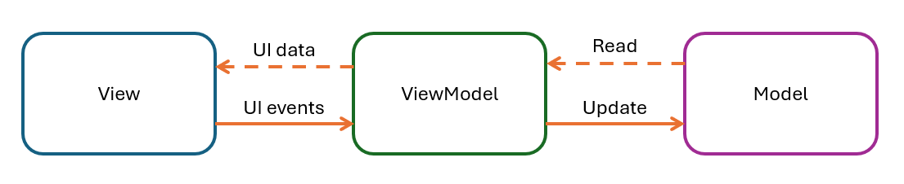
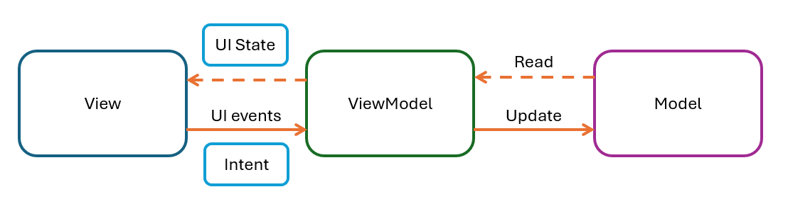

# Обзор архитектурных и design паттернов

## Архитектурные паттерны

### MVVM

#### Как устроен?

Архитектурный паттерн `MVVM` состоит из:
1) `Model` - слой данных и бизнес логики;
2) `View` - слоя представления данных;
3) `ViewModel` - связывает View и Model. Тут подготавливаются данные для отображения на слое представления (View).

Из особенностей можно выделить то, что ViewModel ничего не знает о View, а View, в свою очередь, знает о ViewModel.
View слой не должен иметь никакой логики, кроме той, что отвечает за обновление UI, всю подготовку и обработку данных выполняет ViewModel или Model слой.

Уведомление ViewModel о событиях происходит через методы `viewModel.onSaveButtonClicked()` и т.д., которые дергает View слой.
Чтобы получать обновления UI, View слой подписывается на изменение соответствующих данных у ViewModel, например, `viewModel.onProfileImageEvent()`.
Для этого можно использовать LiveData, Flow или любой другой инструмент поддерживающий Observable паттерн.
Так же можно подписываться на изменения в самом XML.

Схема взаимодействия между слоями в MVVM представлена ниже:

### MVI

#### Как устроен?

Архитектурный паттерн `MVI` состоит из:
1) `Model` - слой данных и бизнес логики;
2) `View` - слоя представления данных;
3) `Intent` - намерения пользователей (действия).

Главная идея `MVI` заключается в управлении состоянием экрана через единый источник правды.
Т.е. UI наделяется некоторым состоянием `State`, которое и описывает текущий интерфейс.
Обновление State происходит в результате определенных действий пользователя.

Я предпочитаю оперировать следующими 2 терминами: `State` - непосредственно состояние UI и `Event` - оно же намерение (Intent) пользователя, например, нажатие кнопки сохранить.
Так же я предпочитаю в MVI выделять слой, который по сути будет напоминать ViewModel слой из MVVM и будет связывать логику View и Model слоев.
View уведомляет ViewModel о событиях через `viewModel.onEvent()`, а события назад приходят через подписку на изменение State, например, `viewModel.viewState`.
Дополнительно, хочется напомнить, что ViewModel ничего не знает о View, а вот View уже знает о ViewModel.

Так же я бы выделил одной из особенностей MVI - это однонаправленный поток данных (Unidirectional Data Flow, сокр. UDF).

## Паттерны проектирования